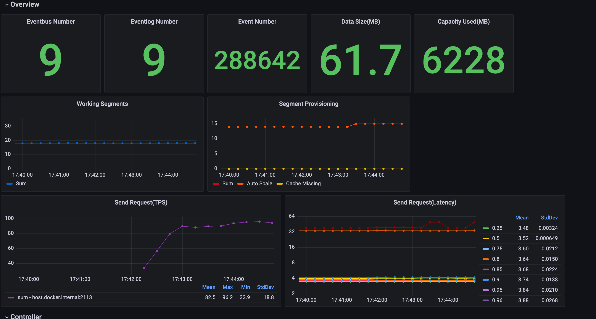
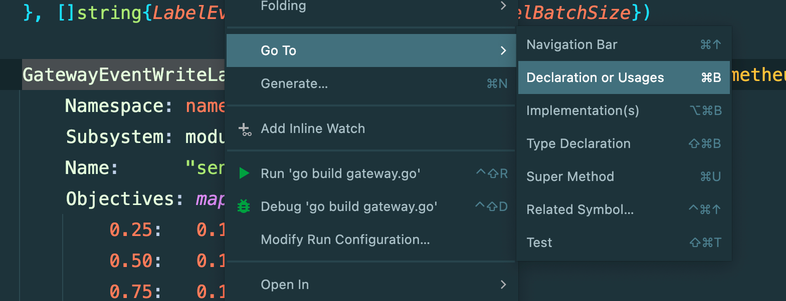
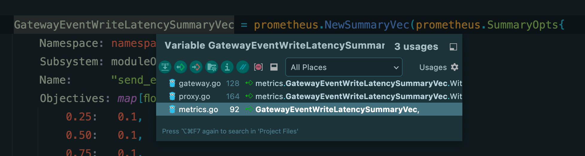
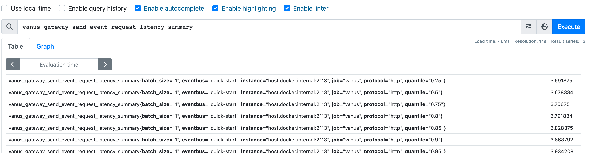
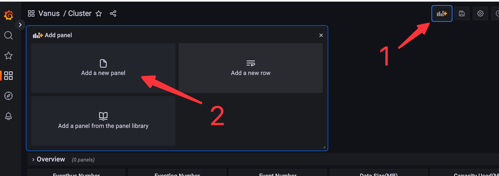
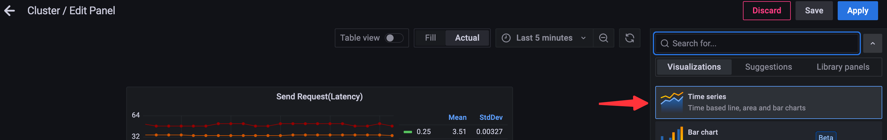
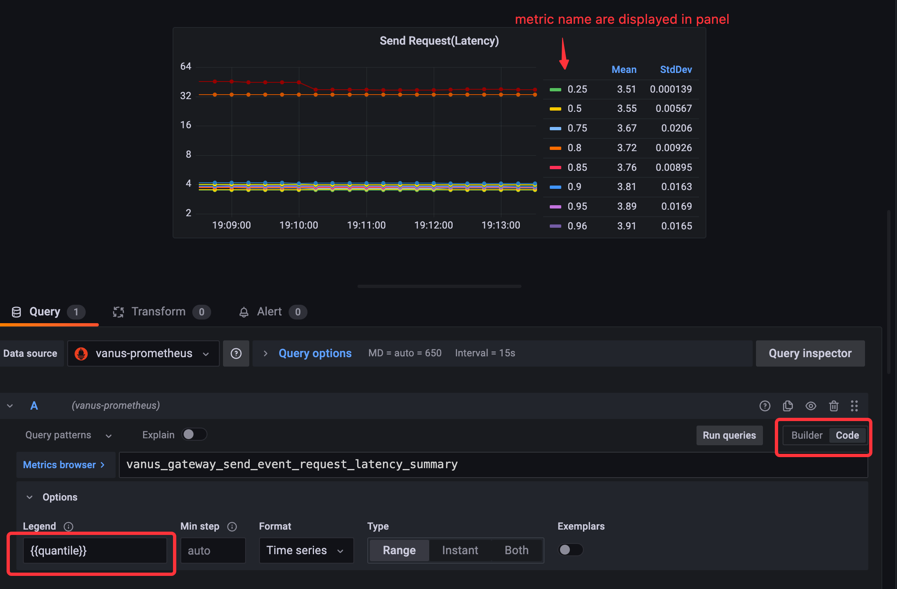
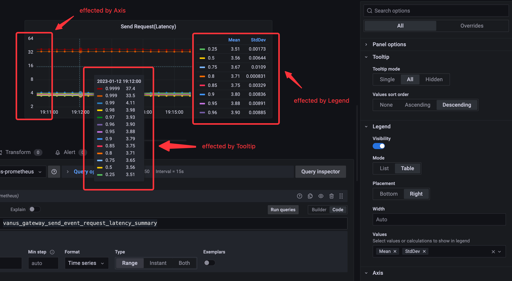
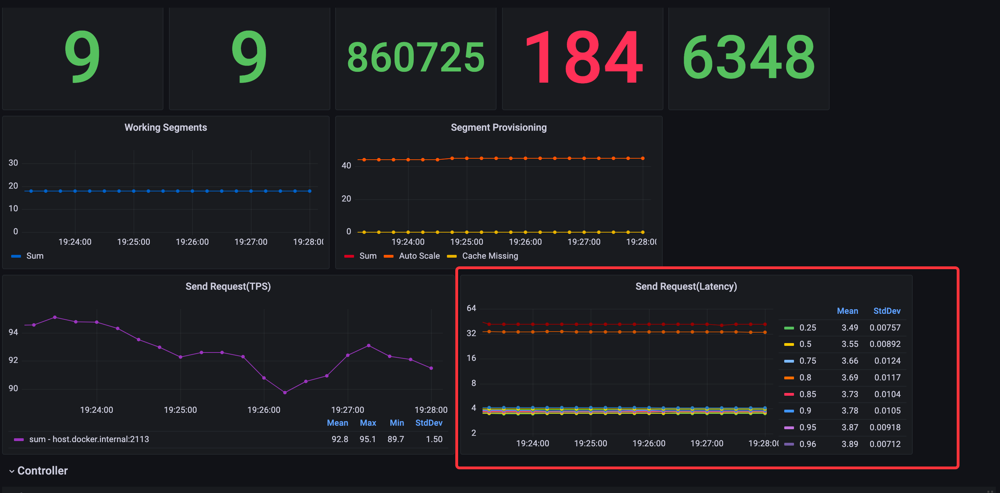
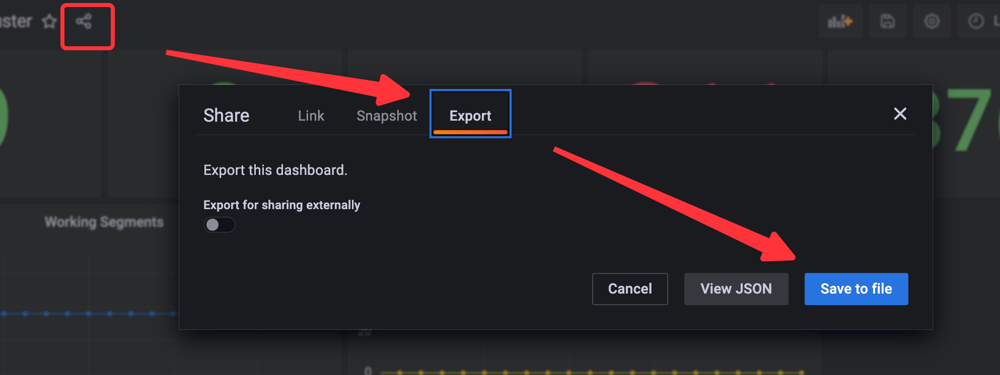

# Observability

The Observability infra for Vanus.

## How to use

```shell
kubectl apply -f https://raw.githubusercontent.com/linkall-labs/observability/main/deploy/all-in-one.yam

kubectl port-forward service/grafana 3000:3000 -n vanus
```

open `localhost:3000` in your browser.



## How to add more metrics

### Step by Step

#### Set local development environment

```shell
docker compose -f deploy/local/docker-compose.yml up
```

after do that, you can visit `localhost:3000` for grafana and `localhost:9090` for Prometheus.

#### Add new metrics

if you want to add new metrics to Vanus, you could refer to [Vanus metrics](https://github.com/linkall-labs/vanus/tree/main/observability/metrics)
to know how these metrics work in Vanus internal.

For instance, if we want to add `send_event_request_latency_summary` to Vanus, which metric record the summary of 
sending events reqeust latency in Gateway component.

Firstly, create `prometheus.NewSummaryVec`,
```go
GatewayEventWriteLatencySummaryVec = prometheus.NewSummaryVec(prometheus.SummaryOpts{
		Namespace: namespace,
		Subsystem: moduleOfGateway,
		Name:      "send_event_request_latency_summary",
		Objectives: map[float64]float64{
			0.25:   0.1,
			0.50:   0.1,
			0.75:   0.1,
			0.80:   0.05,
			0.85:   0.05,
			0.9:    0.05,
			0.95:   0.01,
			0.96:   0.01,
			0.97:   0.01,
			0.98:   0.01,
			0.99:   0.001,
			0.999:  0.0001,
			0.9999: 0.00001},
	}, []string{LabelEventbus, LabelProtocol, LabelBatchSize})
```

you could find this code snippet in [metrics/gateway.go](https://github.com/linkall-labs/vanus/blob/main/observability/metrics/gateway.go).
**NOTE, you could view [Label Consideration](#label-consideration) to know how to configure labels**

Secondly, add this metric to `GetGatewayMetrics()`, which ensure this metric can be registered when Gateway started.

```go
func GetGatewayMetrics() []prometheus.Collector {
	coll := []prometheus.Collector{
		GatewayEventReceivedCountVec,
		GatewayEventWriteLatencySummaryVec,
	}
	return append(coll, getGoRuntimeMetrics()...)
}
```

you could find this function in [metrics/metrics.go](https://github.com/linkall-labs/vanus/blob/main/observability/metrics/gateway.go),

Plus, if you added metrics for other components, notice to add this metrics to relative functions.

Thirdly, record value in right place, if you use Jetbrains Goland, you can find calling by `Right Click -> Go to -> Declaration or Usages` or `command+B`





Other IDEAs also provide the same features.

#### Validate metrics in Prometheus

after you finished adding metrics to Vanus, restart component your metrics added to, open `localhost:9090` to ensure if Prometheus received this metrics.


the prefix `vanus_gateway_` is automatically added, which depends on fields of `Namespace` and `Subsystem` when declare metrics.

#### Configure visual panel in Grafana
 
Next, we need to create a visual panel to show metrics in Grafana. open `localhost:3000`, and select dashboard `Vanus -> Cluster`,
after entre this dashboard, let us create a new panel into Overview.



It isn't easy to edit panel, for visualizing `send_event_request_latency_summary`, we have done follow steps:

1. chose `Time series`(default type of panel)


2. created a single query(aka `PromSQL`) `rate(vanus_gateway_send_event_request_latency_summary_count[1m])`(use `Builder` mode is helpful for create query statement), 
after query was created, we can see curves in the panel. next to set `Option -> Legend`, which effect metric name is displayed in panel, `{{quantile}}` is the one of label in metric.
.

you could find more about how to write query in [official docs](https://prometheus.io/docs/prometheus/latest/querying/basics/). 
Sometimes, it's needed to write query with variables, you can find that how to use it in [Grafana Official documentation](https://grafana.com/docs/grafana/latest/dashboards/variables/)

4. set others options. we changed `Tooltip`, `Legend` and `Axis` for better visual experience.

- `Toolip`: before changed, default values are `Tooltip mode=Single)` and `Values sort order=None`.
- `Legend`: before changed, default values are `Mode=List`, `Placement=Bottom` and `Values=None`.
- `Axis`: before changed, default values are `Scale=Linear`, and set `Log base=2`.


#### Result
After we finished those steps, we can get a new panel in our dashboard.


#### Save configuration
`Share -> Export -> View JSON -> Copy to clipboard`


and replace the [cluster.json](grafana/dashboard/cluster.json) with the JSON you're copied.

#### Submit to upstream
1. commit to GitHub
```shell
git add grafana/dashboard/cluster.json

git commit -sm 'feat: add send_event_request_latency_summary into Cluster dashboard'

git push origin <your branch>
``` 

2. create a PR in [linkall-labs/observability](`https://github.com/linkall-labs/observability`)

### Label Consideration
Coming soon.